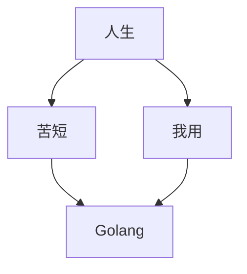

![goWeb][1]

# Go 学习目录

[ 【Go Web编程 - RESTful 框架 】](https://jicki.me/golang/go/2000/01/01/golang-web-note-0 "Go RESTful框架")

[ 【Go Web编程 - Web框架 - Gin 简介 】](https://jicki.me/golang/go/2000/01/01/golang-web-note-1 "Go Web框架- Gin")

  [1]: http://jicki.me/img/posts/golang/goweb.png
