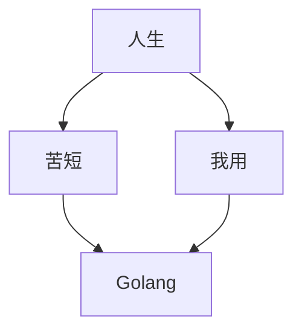

# Go Web编程

![goWeb][1]

# Go 学习目录

[ 【Go Web编程 - PV/UV/IP/PR/并发 】](https://jicki.cn/golang/go/web/2000/01/01/golang-web-note-7 "pv uv 并发")

[ 【Go Web编程 - 通讯协议 TLV 】](https://jicki.cn/golang/go/2000/01/01/golang-web-note-14 "通讯协议 TLV")

[ 【Go Web编程 - RESTful 框架 】](https://jicki.cn/golang/go/2000/01/01/golang-web-note-0 "Go RESTful框架")

[ 【Go Web编程 - Web框架 - MVC 框架 】](https://jicki.cn/golang/go/2000/01/01/golang-web-note-1 "Go Web框架- MVC框架")

[ 【Go Web编程 - Web框架 - Gin 简介 】](https://jicki.cn/golang/go/2000/01/01/golang-web-note-2 "Go Web框架- Gin")

[ 【Go学习笔记 - HTML 基础】](https://jicki.cn/golang/go/2000/01/01/golang-study-note-8 "Go HTML 基础")

[ 【Go学习笔记 - Gin HTML 应用】](https://jicki.cn/golang/go/gin/2000/01/01/golang-web-note-13 "Gin HTML 应用")

[ 【Go Web编程 - 跨域资源共享 CORS 】](https://jicki.cn/golang/go/2000/01/01/golang-web-note-3 "CORS 跨域解决")

[ 【Go Web编程 - sqlx 模块介绍 】](https://jicki.cn/golang/go/2000/01/01/golang-web-note-4 "Go sqlx 模块介绍")

[ 【Go Web编程 - GORM MYSQL 】](https://jicki.cn/golang/go/2000/01/01/golang-web-note-5 "Go GORM MYSQL")

[ 【Go Web编程 - Go go-redis 】](https://jicki.cn/golang/go/2000/01/01/golang-web-note-6 "Go go-redis")

[ 【Go Web编程 - Go Logrus 日志模块 】](https://jicki.cn/golang/go/web/2000/01/01/golang-web-note-8 "Go Logrus 日志模块")

[ 【Go Web编程 - Cookie 与 Session 】](https://jicki.cn/golang/go/2000/01/01/golang-web-note-9 "Cookie 与 Session")

[ 【Go Web编程 - Sonyflake 唯一ID 】](https://jicki.cn/golang/go/2000/01/01/golang-web-note-10 "Sonyflake 唯一ID")

[ 【Go Web编程 - Go Context 模块 】](https://jicki.cn/golang/go/2000/01/01/golang-web-note-11 "Go Context 模块")

[ 【Go Web编程 - Golang to Kafka 】](https://jicki.cn/golang/go/2000/01/01/golang-web-note-12 "Golang to Kafka")

[ 【Go Web编程 - Go 数据传输 Protobuf 】](https://jicki.cn/golang/go/2000/01/01/golang-web-note-15 "Golang Protobuf")

  [1]: https://jicki.cn/img/posts/golang/goweb.png

